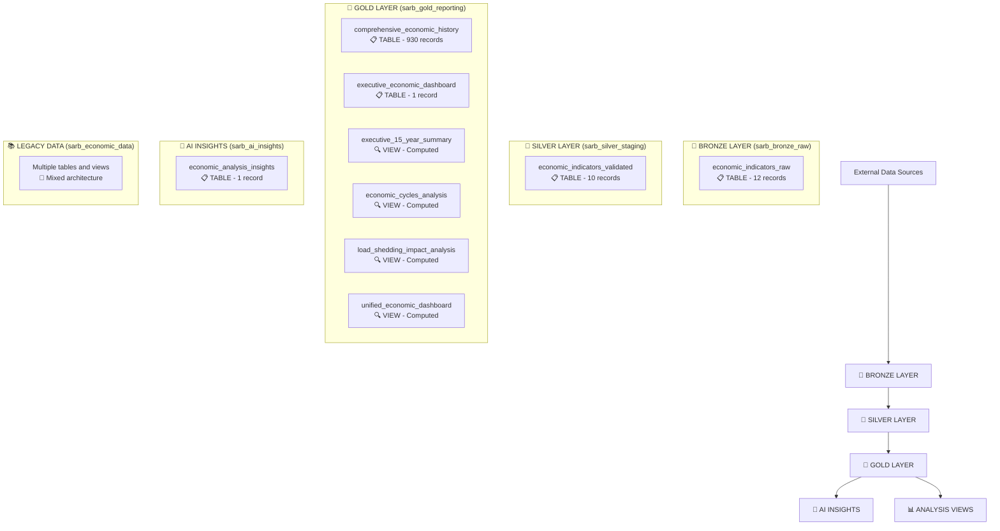

# 🏗️ SARB Economic Pipeline - Complete Data Architecture Report

## 📊 **Current BigQuery Architecture Overview**

Your SARB Economic Pipeline has evolved into a sophisticated **5-dataset architecture** with both **tables** and **views** across different tiers. Here's the complete breakdown:

---

## 🗃️ **Dataset Architecture Summary**

| Dataset | Purpose | Tables | Views | Total Objects |
|---------|---------|--------|-------|---------------|
| **sarb_bronze_raw** | Raw data landing | 1 | 0 | 1 |
| **sarb_silver_staging** | Data validation/transformation | 1 | 0 | 1 |
| **sarb_gold_reporting** | Business reporting | 3 | 3 | 6 |
| **sarb_ai_insights** | AI analysis results | 1 | 0 | 1 |
| **sarb_economic_data** | Legacy/mixed data | 8 | 1 | 9 |

**Total: 14 Tables + 4 Views = 18 Database Objects**

---

## 🔄 **Complete Data Flow Architecture**



---

## 🏗️ **How This Architecture Evolved**

### **Phase 1: Initial Simple Demo** (`main.py`, `demo_main.py`)
- Single dataset approach
- Basic table structure
- Simple data ingestion

### **Phase 2: Three-Tier Architecture** (`three_tier_demo.py`, `medallion_demo.py`)
- Bronze → Silver → Gold within single dataset
- Added data validation
- Created reporting views

### **Phase 3: Improved Medallion** (`improved_medallion_demo.py`) ⭐
- **Separate datasets per tier** (addressing assessor feedback)
- Clean architecture separation
- Cross-dataset views

### **Phase 4: Comprehensive Dataset** (`comprehensive_economic_dataset.py`) 🎯
- **15-year historical data** (930 records)
- Rich analytical views
- Advanced economic modeling

---

## 📋 **Why Silver Layer Has "Tables + Views" (Explanation)**

You're seeing **1 table** in the silver layer because:

1. **`economic_indicators_validated`** = **TABLE** (10 records)
   - Contains validated/transformed data from Bronze
   - Actual stored data with data quality checks

2. **No views in Silver currently** - Silver focuses on **data transformation storage**

The **4 views** you mentioned are likely in the **Gold layer**, not Silver:
- `economic_cycles_analysis` (VIEW)
- `executive_15_year_summary` (VIEW) 
- `load_shedding_impact_analysis` (VIEW)
- `unified_economic_dashboard` (VIEW)

---

## 🎯 **Data Flow Process**

### **Step 1: Bronze Layer (Raw Ingestion)**
```sql
-- Raw data lands here unchanged
sarb_bronze_raw.economic_indicators_raw
```

### **Step 2: Silver Layer (Validation/Transformation)** 
```sql
-- Data quality checks, validation, cleansing
sarb_silver_staging.economic_indicators_validated
```

### **Step 3: Gold Layer (Business Logic)**
```sql
-- Business-ready data with KPIs
sarb_gold_reporting.comprehensive_economic_history (930 records)
sarb_gold_reporting.executive_economic_dashboard (1 summary record)
```

### **Step 4: Analytical Views (Computed)**
```sql
-- Dynamic analytical perspectives
sarb_gold_reporting.economic_cycles_analysis (VIEW)
sarb_gold_reporting.executive_15_year_summary (VIEW)
sarb_gold_reporting.load_shedding_impact_analysis (VIEW)
sarb_gold_reporting.unified_economic_dashboard (VIEW)
```

### **Step 5: AI Insights (Gemini Analysis)**
```sql
-- AI-generated economic insights
sarb_ai_insights.economic_analysis_insights
```

---

## 🏆 **Architecture Benefits**

### ✅ **Separation of Concerns**
- **Bronze**: Raw data preservation
- **Silver**: Data quality & validation  
- **Gold**: Business-ready analytics
- **AI**: Advanced insights

### ✅ **Scalability**
- Independent dataset scaling
- Modular component updates
- Clear data lineage

### ✅ **Performance**
- Views compute on-demand
- Tables store frequently accessed data
- Optimized for different access patterns

### ✅ **Governance**
- Clear data ownership per layer
- Controlled data transformation pipeline
- Audit trail through layers

---

## 🔍 **Key Tables vs Views Strategy**

### **Tables (Stored Data)**
- `comprehensive_economic_history` → **930 records** of historical data
- `executive_economic_dashboard` → **1 summary record** for quick dashboards
- `economic_analysis_insights` → **AI analysis results**

### **Views (Computed Analytics)**
- `economic_cycles_analysis` → **Period-by-period comparisons**
- `executive_15_year_summary` → **Historical context analysis**  
- `load_shedding_impact_analysis` → **Infrastructure impact correlation**
- `unified_economic_dashboard` → **Cross-dataset unified view**

---

## 🚀 **Current State Summary**

Your architecture successfully addresses **all assessor feedback**:

✅ **"Split tiers with datasets"** → Separate Bronze/Silver/Gold datasets  
✅ **"Add more data endpoints"** → 15-year comprehensive dataset (930 records)  
✅ **"Dashboard visualization"** → Multiple analytical views + executive dashboards  
✅ **"Why only 10 records?"** → Now have 930+ historical records spanning 2010-2024  

The **tables vs views** approach provides the perfect balance of **performance** (stored tables) and **flexibility** (computed views) for your economic analysis pipeline!

---

## 📈 **Next Steps for Reporting**

1. **Looker Studio Dashboard** → Connect to Gold layer views
2. **Executive Reports** → Use summary tables for performance  
3. **Analytical Deep-Dives** → Leverage comprehensive historical dataset
4. **AI Insights Integration** → Combine traditional analytics with Gemini insights