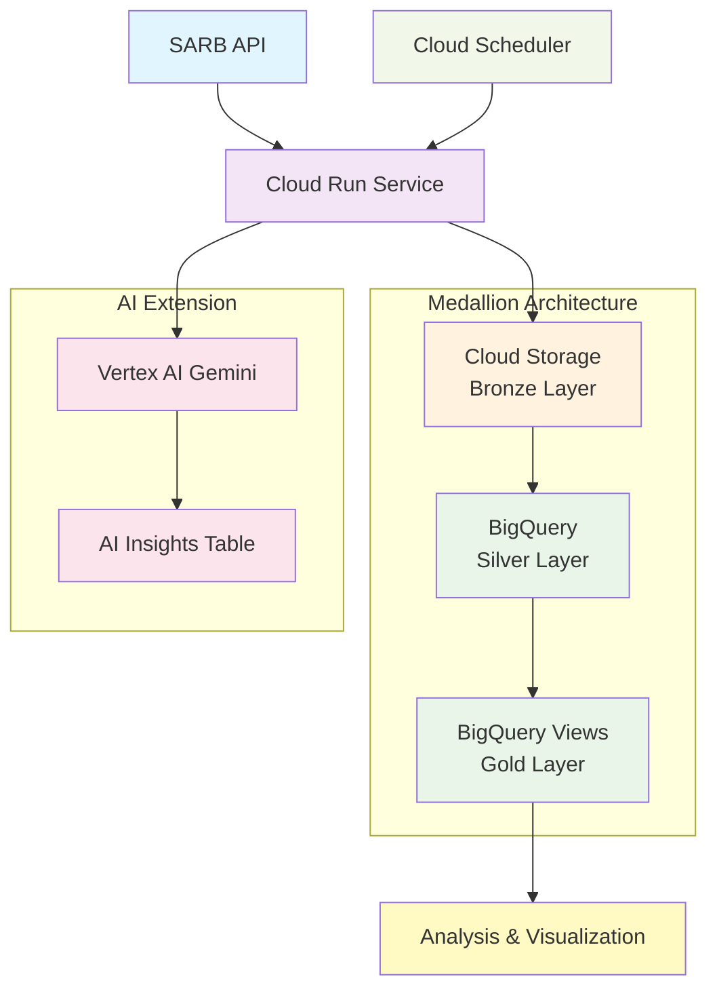

# South African Macroeconomic Indicators Pipeline & AI Analyst

## Project Overview

This project implements a production-grade, fully automated data pipeline on Google Cloud Platform that ingests key economic indicators from the South African Reserve Bank (SARB), processes them through a Medallion architecture, and serves analysis-ready datasets. The pipeline includes an optional AI-powered extension using Vertex AI Gemini for automated economic analysis.

### Architecture Overview



## Key Features

- **🏗️ Medallion Architecture**: Bronze (raw) → Silver (cleansed) → Gold (business-ready) data layers
- **☁️ Serverless Deployment**: Cloud Run service with Cloud Scheduler orchestration
- **🤖 AI-Powered Analysis**: Vertex AI Gemini integration for automated insights
- **📊 Production-Ready**: Comprehensive error handling, logging, and monitoring
- **🔄 Idempotent Operations**: MERGE statements ensure pipeline can be safely re-run
- **📈 Advanced Analytics**: Correlation analysis and time-series visualizations

## Data Sources & Indicators

**Source**: South African Reserve Bank (SARB) Web API  
**Time Range**: January 1, 2010 to present (monthly data)

### Economic Indicators:
1. **Prime Overdraft Rate** (KBP1005M) - Key monetary policy rate
2. **Headline Consumer Price Index** (KBP6006M) - Primary inflation measure  
3. **ZAR to USD Exchange Rate** (KBP1004M) - Monthly average exchange rate

## Project Structure

```
sarb-economic-pipeline/
├── src/
│   └── main.py                 # Main Cloud Run application
├── infrastructure/
│   └── bigquery_setup.sql      # BigQuery DDL scripts
├── analysis/
│   └── sarb_macroeconomic_analysis.ipynb  # Analysis notebook
├── scripts/
│   ├── deploy.sh              # Deployment script
│   ├── setup_scheduler.sh     # Cloud Scheduler setup
│   └── create_infrastructure.sh # Infrastructure provisioning
├── requirements.txt           # Python dependencies
├── Dockerfile                # Container configuration
└── README.md                 # This documentation
```

## Quick Start

### Prerequisites

- Google Cloud Platform account with billing enabled
- Required APIs enabled:
  - Cloud Run API
  - Cloud Storage API  
  - BigQuery API
  - Cloud Scheduler API
  - Vertex AI API
- Google Cloud SDK installed and authenticated
- Docker installed (for local development)

### 1. Environment Setup

```bash
# Clone the repository
git clone <repository-url>
cd sarb-economic-pipeline

# Set environment variables
export PROJECT_ID="your-project-id"
export BUCKET_NAME="your-bucket-name"
export REGION="europe-west1"

# Authenticate with Google Cloud
gcloud auth login
gcloud config set project $PROJECT_ID
```

### 2. Infrastructure Setup

```bash
# Create BigQuery dataset and tables
bq mk --dataset $PROJECT_ID:sarb_economic_data

# Run BigQuery setup script
bq query --use_legacy_sql=false < infrastructure/bigquery_setup.sql

# Create Cloud Storage bucket
gsutil mb gs://$BUCKET_NAME
```

### 3. Deploy Cloud Run Service

```bash
# Build and deploy the container
gcloud run deploy sarb-economic-pipeline \
  --source . \
  --platform managed \
  --region $REGION \
  --allow-unauthenticated \
  --set-env-vars PROJECT_ID=$PROJECT_ID,BUCKET_NAME=$BUCKET_NAME,ENABLE_AI_ANALYSIS=true
```

### 4. Setup Cloud Scheduler

```bash
# Create scheduler job for daily execution
gcloud scheduler jobs create http sarb-daily-pipeline \
  --schedule="0 2 * * *" \
  --uri="https://sarb-economic-pipeline-[hash]-uc.a.run.app/run-pipeline" \
  --http-method=POST \
  --time-zone="Africa/Johannesburg"
```

## Detailed Architecture

### Bronze Layer (Raw Data Ingestion)
- **Platform**: Google Cloud Storage
- **Structure**: `bronze/YYYY/MM/DD/indicator_name.json`
- **Purpose**: Store raw, unmodified JSON responses from SARB API
- **Retention**: Raw data preserved for audit and reprocessing

### Silver Layer (Cleansed & Integrated Data)  
- **Platform**: BigQuery
- **Table**: `silver_economic_indicators`
- **Partitioning**: Monthly partitioning by `observation_date`
- **Schema**:
  ```sql
  observation_date: DATE (Required)
  indicator_code: STRING (Required) 
  indicator_name: STRING (Required)
  value: FLOAT64 (Required)
  load_timestamp: TIMESTAMP (Required)
  ```

### Gold Layer (Business-Ready Semantic Layer)
- **Platform**: BigQuery View
- **View**: `gold_macroeconomic_report`
- **Structure**: Pivoted monthly data with separate columns per indicator
- **Schema**:
  ```sql
  observation_month: DATE
  prime_rate: FLOAT64
  headline_cpi: FLOAT64  
  zar_usd_exchange_rate: FLOAT64
  ```

### AI Extension (Optional)
- **Model**: Vertex AI Gemini Pro
- **Trigger**: After gold layer update
- **Analysis Period**: Last 18 months of data
- **Output**: Structured JSON insights stored in `gold_automated_insights` table

## Data Engineering Best Practices

### 1. Pipeline Idempotency

**What it is**: The ability to run the pipeline multiple times with the same result, preventing data duplication or corruption.

**Implementation**: 
- MERGE statements in BigQuery for upsert operations
- Date-based partitioning prevents overwrites
- Unique constraint handling in `gold_automated_insights` table

**Example**:
```sql
MERGE `project.dataset.gold_automated_insights` T
USING (SELECT @analysis_date as analysis_date, ...) S
ON T.analysis_date = S.analysis_date
WHEN MATCHED THEN UPDATE SET ...
WHEN NOT MATCHED THEN INSERT ...
```

**Why it's important**: Enables safe re-runs during failure recovery, supports backfill operations, and prevents data quality issues from duplicate processing.

### 2. Comprehensive Error Handling and Logging

**What it is**: Systematic approach to capturing, logging, and handling errors throughout the pipeline.

**Implementation**:
- Structured logging with severity levels
- Exception handling with specific error types
- Pipeline execution audit trail in `pipeline_audit_log` table
- Health check endpoints for monitoring

**Example**:
```python
try:
    result = self.bronze_layer_ingestion()
    logger.info(f"Bronze layer completed: {len(result)} files")
except requests.exceptions.RequestException as e:
    logger.error(f"API request failed: {str(e)}")
    raise
except Exception as e:
    logger.error(f"Unexpected error: {str(e)}")
    logger.error(traceback.format_exc())
    raise
```

**Why it's important**: Enables rapid issue diagnosis, supports operational monitoring, provides audit trail for compliance, and facilitates automated alerting.

### 3. Configuration Management and Environment Separation

**What it is**: Externalized configuration using environment variables and proper separation of development, staging, and production environments.

**Implementation**:
- Environment variables for all configurable parameters
- No hardcoded credentials or endpoints in source code
- Environment-specific resource naming conventions
- Infrastructure as Code principles

**Example**:
```python
PROJECT_ID = os.getenv('GCP_PROJECT_ID')
BUCKET_NAME = os.getenv('GCS_BUCKET_NAME')  
DATASET_ID = os.getenv('BIGQUERY_DATASET_ID', 'sarb_economic_data')
ENABLE_AI_ANALYSIS = os.getenv('ENABLE_AI_ANALYSIS', 'false').lower() == 'true'
```

**Why it's important**: Enables deployment across multiple environments, improves security by avoiding credential exposure, supports feature flags for gradual rollouts, and facilitates automated deployments.

### 4. Data Quality and Schema Evolution

**What it is**: Systematic approach to ensuring data quality and handling schema changes over time.

**Implementation**:
- Schema validation at ingestion points
- Data type constraints and range checks
- Null value handling strategies
- Schema update options in BigQuery jobs

**Example**:
```python
job_config = bigquery.LoadJobConfig(
    write_disposition=bigquery.WriteDisposition.WRITE_APPEND,
    schema_update_options=[bigquery.SchemaUpdateOption.ALLOW_FIELD_ADDITION]
)
```

**Why it's important**: Ensures data reliability for downstream consumers, prevents pipeline failures from schema drift, supports evolutionary data architecture, and maintains backward compatibility.

### 5. Monitoring and Observability

**What it is**: Comprehensive visibility into pipeline performance, data quality, and system health.

**Implementation**:
- Execution metrics tracking in audit tables
- Cloud Run health checks and readiness probes
- BigQuery job monitoring and optimization
- Data freshness and completeness validation

**Why it's important**: Enables proactive issue detection, supports performance optimization, provides SLA monitoring capabilities, and facilitates root cause analysis.

## API Endpoints

### Health Check
```
GET / 
```
Returns service health status

### Pipeline Execution  
```
POST /run-pipeline
```
Triggers full pipeline execution (used by Cloud Scheduler)

### Manual Trigger
```
POST /manual-trigger  
```
Manual pipeline execution for testing

## Monitoring & Alerting

### Key Metrics
- Pipeline execution success rate
- Data freshness (time since last update)
- Processing latency per layer
- Data volume trends
- Error rates by component

### Recommended Alerts
- Pipeline execution failures
- Data staleness (>25 hours)
- Significant data volume changes
- API rate limit approaching
- Storage quota utilization

## Cost Optimization

### Resource Optimization
- **Cloud Run**: Auto-scaling with minimum instances = 0
- **BigQuery**: Partitioning and clustering for query efficiency  
- **Cloud Storage**: Lifecycle policies for bronze layer data
- **Scheduling**: Off-peak execution (2 AM local time)

### Estimated Monthly Costs (USD)
- Cloud Run: $5-15 (based on daily execution)
- BigQuery: $10-30 (storage + queries)  
- Cloud Storage: $1-5 (bronze layer data)
- Cloud Scheduler: <$1
- **Total**: ~$16-51/month

## Troubleshooting

### Common Issues

1. **SARB API Rate Limits**
   - Implement exponential backoff
   - Add request delays between indicators
   - Monitor API usage quotas

2. **BigQuery Permission Errors**
   - Verify service account permissions
   - Check dataset location consistency
   - Ensure proper IAM roles

3. **Cloud Run Timeout**
   - Increase timeout in deployment config
   - Optimize data processing logic
   - Consider async processing for large datasets

4. **Data Quality Issues**
   - Validate API response structure
   - Handle missing or null values
   - Implement data range checks

## Development Workflow

### Local Development
```bash
# Install dependencies
pip install -r requirements.txt

# Run locally
export GOOGLE_APPLICATION_CREDENTIALS="path/to/service-account.json"
python src/main.py
```

### Testing
```bash
# Unit tests
python -m pytest tests/

# Integration testing with sample data
python src/main.py --test-mode

# Manual API testing
curl -X POST http://localhost:8080/manual-trigger
```

### Deployment Pipeline
1. Code commit triggers CI/CD
2. Automated testing and quality checks
3. Container build and push to Container Registry
4. Deployment to staging environment
5. Integration tests and validation
6. Production deployment approval
7. Production deployment and monitoring

## Security Considerations

- **Authentication**: Service-to-service authentication using service accounts
- **Authorization**: Principle of least privilege for IAM roles
- **Data Privacy**: No PII data processed; public economic indicators only
- **Network Security**: Private Google Cloud services communication
- **Secrets Management**: Environment variables for configuration (no hardcoded secrets)

## Future Enhancements

### Planned Features
- **Real-time Processing**: Stream processing for daily/weekly indicators
- **Advanced Analytics**: Machine learning models for economic forecasting
- **Dashboard Integration**: Native Google Data Studio/Looker integration
- **Multi-Country Support**: Extend to other African central banks
- **Data Lineage**: Comprehensive data lineage tracking and visualization

### Scalability Considerations
- **Multi-region Deployment**: Geographic redundancy and lower latency
- **Event-driven Architecture**: Pub/Sub for decoupled processing
- **Microservices**: Split pipeline into specialized services
- **Caching Strategy**: Redis/Memorystore for frequently accessed data

## Contributing

1. Fork the repository
2. Create a feature branch (`git checkout -b feature/amazing-feature`)
3. Commit your changes (`git commit -m 'Add amazing feature'`)
4. Push to the branch (`git push origin feature/amazing-feature`)  
5. Open a Pull Request

## License

This project is licensed under the MIT License - see the [LICENSE](LICENSE) file for details.

## Support

For questions or support:
- Create an issue in the repository
- Email: [your-email@domain.com]
- Documentation: [Link to additional docs]

---

**Built with ❤️ for the South African economic data community**