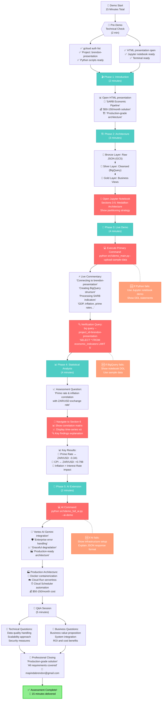

```mermaid
flowchart TD
    %% Demo Flow Overview
    START["🚀 Demo Start<br/>15 Minutes Total"] --> CHECK{{"🔧 Pre-Demo<br/>Technical Check<br/>(2 min)"}}
    
    %% Pre-Demo Checklist
    CHECK --> GCLOUD["✅ gcloud auth list<br/>✅ Project: brendon-presentation<br/>✅ Python scripts ready"]
    CHECK --> FILES["✅ HTML presentation open<br/>✅ Jupyter notebook ready<br/>✅ Terminal ready"]
    
    GCLOUD --> PHASE1
    FILES --> PHASE1
    
    %% Phase 1: Introduction
    PHASE1["🎬 Phase 1: Introduction<br/>(2 minutes)"] --> INTRO["📊 Open HTML presentation<br/>🏦 'SARB Economic Pipeline'<br/>💰 '$50-150/month solution'<br/>🏗️ 'Production-grade architecture'"]
    
    INTRO --> PHASE2
    
    %% Phase 2: Architecture
    PHASE2["🏗️ Phase 2: Architecture<br/>(3 minutes)"] --> ARCH["🥉 Bronze Layer: Raw JSON (GCS)<br/>⬇️<br/>🥈 Silver Layer: Cleansed (BigQuery)<br/>⬇️<br/>🥇 Gold Layer: Business Views"]
    
    ARCH --> NOTEBOOK1["📓 Open Jupyter Notebook<br/>Sections 3-5: Medallion Architecture<br/>Show partitioning strategy"]
    
    NOTEBOOK1 --> PHASE3
    
    %% Phase 3: Live Demo
    PHASE3["🚀 Phase 3: Live Demo<br/>(4 minutes)"] --> DEMO_CMD["💻 Execute Primary Command:<br/>python src\\demo_main.py --upload-sample-data"]
    
    DEMO_CMD --> DEMO_EXEC["⚡ Live Commentary:<br/>'Connecting to brendon-presentation'<br/>'Creating BigQuery structure'<br/>'Processing SARB indicators'<br/>'GDP, inflation, prime rates...'"]
    
    DEMO_EXEC --> VERIFY["🔍 Verification Query:<br/>bq query --project_id=brendon-presentation<br/>'SELECT * FROM economic_indicators LIMIT 5'"]
    
    VERIFY --> PHASE4
    
    %% Phase 4: Analysis
    PHASE4["📊 Phase 4: Statistical Analysis<br/>(4 minutes)"] --> ANALYSIS["📈 Assessment Question:<br/>'Prime rate & inflation correlation<br/>with ZAR/USD exchange rate'"]
    
    ANALYSIS --> NOTEBOOK2["📓 Navigate to Section 6<br/>📊 Show correlation matrix<br/>📈 Display time-series viz<br/>🔍 Key findings explanation"]
    
    NOTEBOOK2 --> FINDINGS["📊 Key Results:<br/>🔸 Prime Rate ↔ ZAR/USD: -0.341<br/>🔸 CPI ↔ ZAR/USD: +0.798<br/>🔸 Inflation > Interest Rate impact"]
    
    FINDINGS --> PHASE5
    
    %% Phase 5: AI Extension
    PHASE5["🤖 Phase 5: AI Extension<br/>(2 minutes)"] --> AI_DEMO["💻 AI Command:<br/>python src\\demo_full_ai.py --ai-demo"]
    
    AI_DEMO --> AI_EXPLAIN["🤖 'Vertex AI Gemini integration'<br/>🛡️ 'Enterprise error handling'<br/>📈 'Graceful degradation'<br/>🏭 'Production-ready architecture'"]
    
    AI_EXPLAIN --> PROD["🏭 Production Architecture:<br/>🐳 Docker containerization<br/>☁️ Cloud Run serverless<br/>⏰ Cloud Scheduler automation<br/>💰 $50-150/month cost"]
    
    PROD --> QA
    
    %% Q&A and Closing
    QA["🎯 Q&A Session<br/>(5 minutes)"] --> TECH_Q["🔧 Technical Questions:<br/>Data quality handling<br/>Scalability approach<br/>Security measures"]
    
    QA --> BIZ_Q["💼 Business Questions:<br/>Business value proposition<br/>System integration<br/>ROI and cost benefits"]
    
    TECH_Q --> CLOSING
    BIZ_Q --> CLOSING
    
    CLOSING["🚀 Professional Closing<br/>'Production-grade solution'<br/>'All requirements covered'<br/>📧 mapindabrendon@gmail.com"] --> SUCCESS["✅ Assessment Complete!<br/>🎉 15 minutes delivered"]
    
    %% Emergency Backup Flows
    DEMO_CMD -.- BACKUP1["🆘 If Python fails:<br/>Use Jupyter notebook demo<br/>Show DDL statements"]
    VERIFY -.- BACKUP2["🆘 If BigQuery fails:<br/>Show notebook DDL<br/>Use sample data"]
    AI_DEMO -.- BACKUP3["🆘 If AI fails:<br/>Show infrastructure setup<br/>Explain JSON response format"]
    
    %% Styling
    classDef phaseStyle fill:#4ECDC4,stroke:#45B7B8,stroke-width:2px,color:white
    classDef actionStyle fill:#FF6B6B,stroke:#E55A5A,stroke-width:2px,color:white
    classDef emergencyStyle fill:#FFA07A,stroke:#FF7F50,stroke-width:2px,color:white
    classDef successStyle fill:#90EE90,stroke:#32CD32,stroke-width:3px,color:black
    
    class PHASE1,PHASE2,PHASE3,PHASE4,PHASE5 phaseStyle
    class DEMO_CMD,VERIFY,AI_DEMO,NOTEBOOK1,NOTEBOOK2 actionStyle
    class BACKUP1,BACKUP2,BACKUP3 emergencyStyle
    class SUCCESS successStyle
```